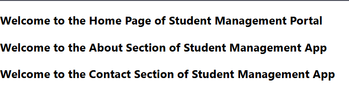

# 📘 React Components Overview

## 🔹 What are React Components?

React components are the **building blocks** of any React application. A component is a **reusable piece of code** that defines how a part of the UI should appear and behave. Each component is isolated and can maintain its own **state** and **lifecycle methods**.

React allows components to be **nested**, **reused**, and **composed**, enabling modular and maintainable code.

---

## 🔹 Difference Between Components and JavaScript Functions

| Feature | JavaScript Function | React Component |
|--------|---------------------|-----------------|
| Purpose | Performs an operation or returns a value | Defines a piece of UI |
| Return | Primitive/objects/functions | JSX (UI elements) |
| Naming | Can use any name | Must start with a capital letter |
| Reusability | Not intended for UI reuse | Designed for UI reuse |
| Lifecycle | No lifecycle | Has lifecycle methods (in class components) |

---

## 🔹 Types of Components in React

1. **Class Components**
2. **Function Components**

---

## 🔹 Class Component

Class components are **ES6 classes** that extend the base class `React.Component`. They are useful when a component needs to use **state**, **lifecycle methods**, or **more complex logic**.

### 📄 Syntax:

```jsx
import React, { Component } from 'react';

class Welcome extends Component {
  render() {
    return <h1>Hello, {this.props.name}</h1>;
  }
}
```

### ✅ Key Features:
- Can hold **state** using `this.state`
- Can access **lifecycle methods**
- Uses `this.props` and `this.state`

---

## 🔹 Function Component

Function components are simple JavaScript functions that return JSX. They can be **stateless or stateful** using **React Hooks** like `useState` and `useEffect`.

### 📄 Syntax:

```jsx
import React from 'react';

function Welcome(props) {
  return <h1>Hello, {props.name}</h1>;
}
```

Or using arrow function:

```jsx
const Welcome = (props) => <h1>Hello, {props.name}</h1>;
```

### ✅ Key Features:
- Simpler and more concise
- Can use Hooks for **state** and **side effects**
- No `this` keyword required

---

## 🔹 Component Constructor

The `constructor` is a special method used in **class components** to initialize **state** and bind methods.

### 📄 Example:

```jsx
class Welcome extends React.Component {
  constructor(props) {
    super(props);
    this.state = { message: "Welcome!" };
  }
}
```

### ✅ Notes:
- `super(props)` must be called before accessing `this`
- Used for setting up initial state or method bindings

---

## 🔹 render() Function

The `render()` method is **mandatory in class components** and returns the JSX to be displayed on the UI.

### 📄 Example:

```jsx
render() {
  return <h1>{this.state.message}</h1>;
}
```

### ✅ Notes:
- Should be **pure** (no side effects)
- Called on every **re-render** of the component

---

## ✅ Summary

- React components define parts of a UI.
- Components can be created using **classes** or **functions**.
- **Function components** are preferred in modern React due to simplicity and Hooks.
- The `constructor()` and `render()` methods are specific to **class components**.

---

🧠 *React promotes component-based architecture to write maintainable and scalable UIs!*


## ✅ Output
