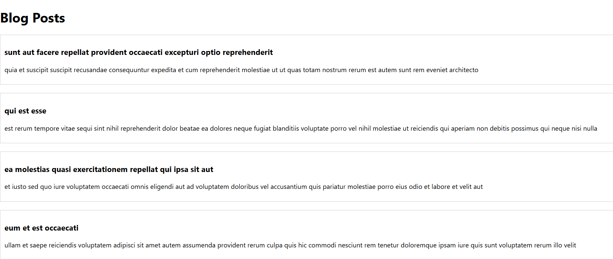

# 🔄 React Component Lifecycle

This document explains the **need and benefits** of the React component lifecycle, identifies various **lifecycle hook methods**, and outlines the **sequence of steps in rendering** a component.

---

## 🧾 Table of Contents

- [Explain the need and Benefits of component life cycle](#-explain-the-need-and-benefits-of-component-life-cycle)
- [Identify various life cycle hook methods](#-identify-various-life-cycle-hook-methods)
- [List the sequence of steps in rendering a component](#-list-the-sequence-of-steps-in-rendering-a-component)

---

## • Explain the need and Benefits of component life cycle

The **component lifecycle** in React represents the series of phases a component goes through during its existence — from creation and rendering to updates and eventual unmounting.

### ✅ Need:
- To perform specific actions at different stages of a component's life.
- To manage side effects like API calls, DOM updates, and cleanup tasks.
- To optimize performance and manage resources effectively.

### ✅ Benefits:
- Allows **controlled rendering** and updates.
- Enables **data fetching** at the correct time (e.g., when the component mounts).
- Helps with **resource management** through cleanup on unmounting.
- Supports **debugging and logging** with lifecycle methods.
- Encourages separation of concerns by placing logic in appropriate lifecycle stages.

---

## • Identify various life cycle hook methods

Lifecycle methods are categorized based on the component's phase:

### 🔹 Mounting (when component is being added to the DOM):
- `constructor()`
- `static getDerivedStateFromProps()`
- `render()`
- `componentDidMount()`

### 🔹 Updating (when props or state change):
- `static getDerivedStateFromProps()`
- `shouldComponentUpdate()`
- `render()`
- `getSnapshotBeforeUpdate()`
- `componentDidUpdate()`

### 🔹 Unmounting (when component is being removed):
- `componentWillUnmount()`

### 🔹 Error Handling:
- `componentDidCatch()`
- `static getDerivedStateFromError()`

> ⚠️ Note: Some older methods like `componentWillMount()` are deprecated in newer versions of React.

---

## • List the sequence of steps in rendering a component

When a component is rendered, React follows a defined lifecycle sequence:

### 🔵 Mounting Phase (Initial Render):
1. `constructor()`
2. `getDerivedStateFromProps()`
3. `render()`
4. `componentDidMount()`

### 🟢 Updating Phase (Re-render due to prop/state change):
1. `getDerivedStateFromProps()`
2. `shouldComponentUpdate()`
3. `render()`
4. `getSnapshotBeforeUpdate()`
5. `componentDidUpdate()`

### 🔴 Unmounting Phase:
1. `componentWillUnmount()`

> ✅ Understanding this sequence is essential to manage side effects, fetch data, and optimize component performance effectively.

---

📘 By mastering the component lifecycle, developers can build **efficient**, **responsive**, and **resource-conscious** React applications.

---

## 📸 Output

