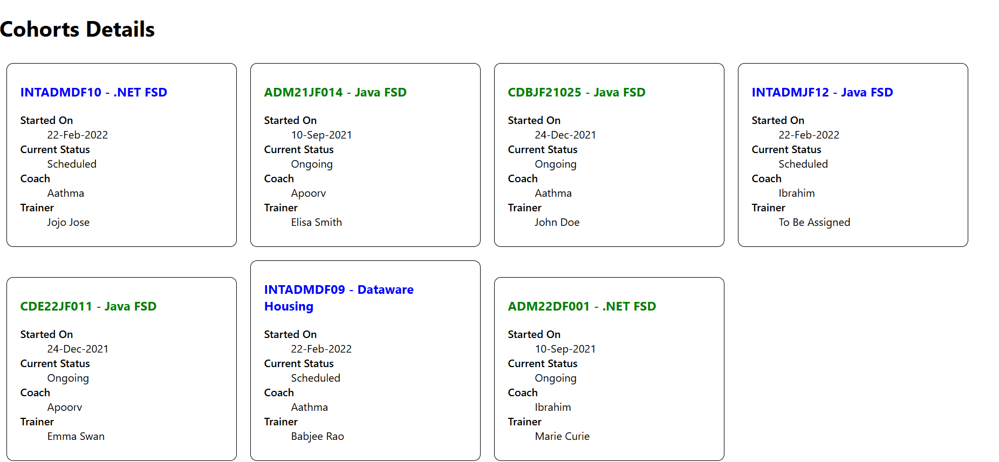

# Styling React Components

This guide explains the need for styling React components and demonstrates how to style them using **CSS Modules** and **inline styles**.

---

## 📌 Understanding the Need for Styling React Components

In any frontend application, visual appearance plays a crucial role in enhancing **user experience**, **usability**, and **readability**. React, being a component-based framework, promotes styling at the component level to maintain separation of concerns and encourage modular design.

### Why Style React Components?
- To create a visually appealing UI
- To reflect the brand's color scheme and design standards
- To provide feedback to user actions (hover, click, etc.)
- To improve accessibility and responsiveness
- To encapsulate styles with components for better maintainability

---

## 🎨 Working with CSS Modules

### What are CSS Modules?
CSS Modules are **locally scoped CSS files**. They help avoid global scope issues common with traditional CSS by scoping the styles to individual components.

### How to Use:
1. Create a CSS file with `.module.css` extension (e.g., `CohortDetails.module.css`)
2. Import it in the component:
   ```jsx
   import styles from './CohortDetails.module.css';


## Output
